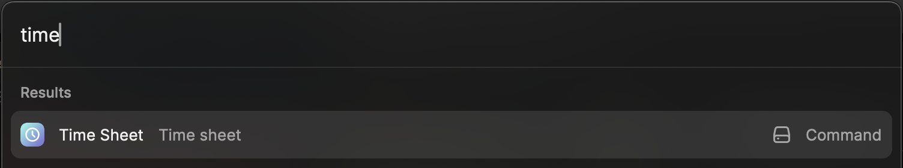

# Time Sheet

Raycast extension to automate filling timesheet

## Installation

Clone the project and install dependencies

```bash
npm i
```

Build the project

```bash
npm run build
```

Then you should be able to see the Time Sheet command in your Raycast.



## Development

Start local development

```bash
npm run dev
```

## Setup Google Calendar

To import tasks from the Google Calendar you will need to follow the following Steps:

<ol>
    <li> Visit the google api
        <a href="https://console.cloud.google.com/apis/credentials">API-Console</a>
    </li>
    <li> Click create Credentials and choose <u>OAuth Client Id</u> </li>
    <li> Choose iOS as Application Type and com.raycast as the Bundle ID </li>
</ol>
Finally you have the client id <br>
You now need to set the Google Calendar client in the Extension configuration 
Checkout <br>
<a href="https://manual.raycast.com/preferences">Raycase Manual for instructions on how to do so</a>

## Features

-   Crete, edit, delete tasks
-   Export tasks to json or Yaml file
-   Import tasks from google calendar
-   Duplicate task
